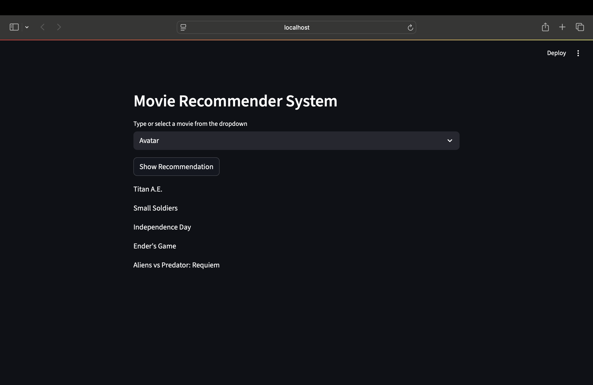

# Movies Recommender System  
A machine learning–based application that recommends movies similar to the one you like. Built using **Python**, **Streamlit**, and **Scikit-learn**, it leverages content-based filtering with precomputed cosine similarity for fast, accurate suggestions.  

## Features  
- Content-Based Filtering – Finds movies similar to your chosen one  
- Search Functionality – Instantly search any movie in the dataset  
- Interactive UI – Built with Streamlit for easy use  
- Precomputed Similarity – Quick recommendations without retraining  

## Tech Stack  
- Python, Pandas, NumPy  
- Scikit-learn (CountVectorizer, Cosine Similarity)  
- Streamlit (frontend)  
- Pickle (data/model storage)  

## Dataset  
Uses preprocessed movie metadata (titles, genres, overviews, cast, crew).

